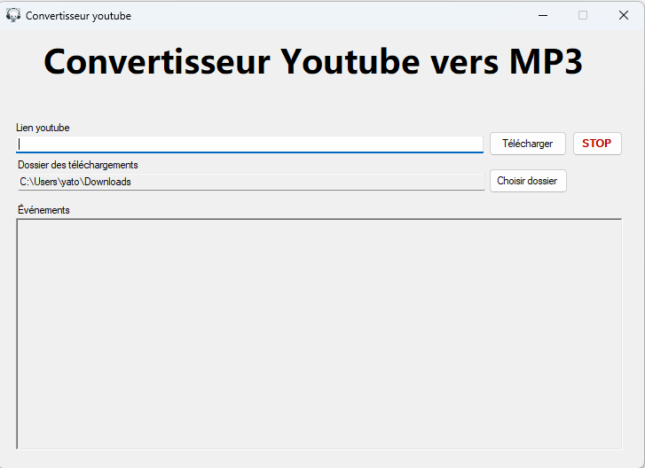

# YTMusic-Desktop

Desktop application in C# that allows you to download youtube videos and playlists as mp3 files.

**WARNING**

Do not use this application to download copyrighted content. Only use this on content you own or content you've been authorized to copy as audio files.

**Installation**

1. Download the latest release at: https://github.com/KevGoDev/ytmusic-desktop/releases/latest.
2. Extract the **entire** `YTMusic` folder to your computer, example: `Desktop\YTMusic`
3. Run the `YTMusic.exe` file inside your YTMusic folder.

**Screenshot**

